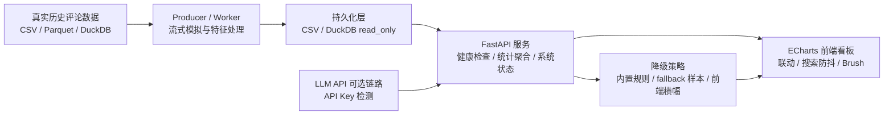

# Week14 M4 系统联调与工程规范交付项目

## Project Overview & Features

本项目是一款基于“轻量级高性能数据栈 + 大语言模型 API 降级守卫”的高校课程实验交付项目。它在 Week12/13 的 FastAPI + ECharts 多维评论看板基础上，补齐了一键启动、依赖规范、系统状态透传和防御性 fallback，目标是从“能跑的实验代码”推进到“可迁移、可验收、可维护”的工程交付物。

核心特色：

1. 真实评论数据驱动：使用 `online_shopping_10_cats.csv` 的 `62774` 条真实评论与 10 个品类。
2. 前后端解耦看板：FastAPI 提供 JSON API，前端 ECharts 支持品类、情感、正则搜索和 Brush 框选联动。
3. 系统级降级守卫：缺少 API Key 或主数据文件时不直接崩溃，而是通过 `/api/system-status` 向前端显式提示。
4. 工程化启动与交付：`run_app.py` 完成依赖自检、端口检测、子进程管理、健康检查和浏览器自动打开。

## System Architecture



## Quick Start

在项目根目录 `E:\Data_Analyze_test\test\test14` 下执行：

```powershell
python -m venv test_env
.\test_env\Scripts\Activate.ps1
python -m pip install --upgrade pip
python -m pip install -r requirements.txt
python run_app.py
```

如果使用课程已有环境，也可以在上级目录执行：

```powershell
cd test14
..\data_env\Scripts\python.exe run_app.py
```

启动成功后脚本会自动打开前端页面，默认从 `8014` 端口开始检测；若端口被占用，会自动顺延到下一个可用端口。

## Configurations

大模型功能是可选扩展。若未配置 API Key，系统不会崩溃，而会在控制台和前端顶部横幅明确提示降级状态。

支持的环境变量：

```text
SILICONFLOW_API_KEY
DASHSCOPE_API_KEY
OPENAI_API_KEY
```

端口可通过启动参数修改：

```powershell
python run_app.py --port 8020
```

只启动服务、不自动打开浏览器：

```powershell
python run_app.py --no-browser
```

## Directory Tree

```text
test14/
├─ README.md
├─ requirements.txt
├─ run_app.py
├─ validate_system.py
├─ .env.example
├─ .gitignore
├─ dashboard/
│  ├─ server.py
│  ├─ requirements.txt
│  └─ frontend/
│     └─ index.html
├─ data/
│  ├─ online_shopping_10_cats.csv
│  ├─ batch_1000_features.csv
│  └─ fallback_reviews_sample.csv
├─ images/
├─ output/
└─ 实验十四_M4系统联调与工程规范实验报告.md
```

关键文件说明：

- `run_app.py`：一键启动脚本，负责环境自检、端口检测、Uvicorn 子进程启动、健康检查和优雅退出。
- `dashboard/server.py`：FastAPI 后端，提供数据统计、评论查询、系统状态、Brush 散点数据等接口。
- `dashboard/frontend/index.html`：ECharts 前端看板，支持多维联动、搜索防抖、Brush 框选和降级横幅提示。
- `requirements.txt`：手动整理的最小依赖清单，避免全局 `pip freeze` 导致冗余依赖。
- `.gitignore`：防止 CSV、Parquet、DuckDB、虚拟环境和 IDE 缓存误提交。

## API Health Check

启动后可访问：

```text
http://127.0.0.1:8014/api/health
http://127.0.0.1:8014/api/system-status
http://127.0.0.1:8014/docs
```

其中 `/api/system-status` 会返回 LLM API Key 配置状态、数据源降级状态和 DuckDB 只读连接策略。
