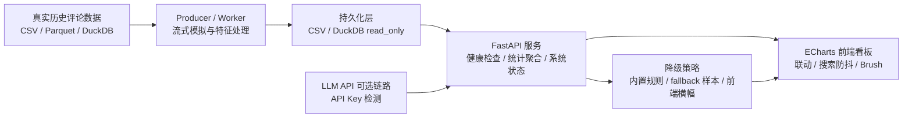
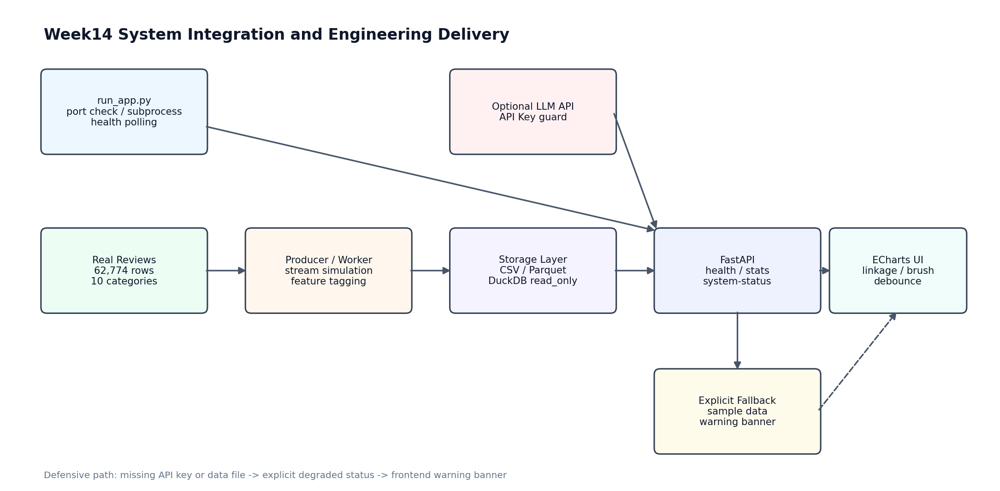

# 实验十四 M4 系统联调与工程规范实验报告

**学生姓名**：王鹏 &emsp; **学号**：9109223147 &emsp; **专业班级**：23级综合实验班  
实验类型：□ 验证 □ 综合 ■ 设计 □ 创新 &emsp; 实验日期：2026.6 &emsp; 实验成绩：

## 一、实验环境

| 项目 | 配置 |
| --- | --- |
| 操作系统 | Windows + PowerShell |
| Python 环境 | `E:\Data_Analyze_test\test\data_env\Scripts\python.exe` |
| 实验目录 | `E:\Data_Analyze_test\test\test14` |
| 后端框架 | FastAPI |
| ASGI 服务器 | Uvicorn |
| 前端技术 | HTML + CSS + JavaScript + ECharts |
| 数据文件 | `online_shopping_10_cats.csv`、`batch_1000_features.csv`、`fallback_reviews_sample.csv` |
| 工程交付文件 | `run_app.py`、`README.md`、`requirements.txt`、`.gitignore` |

后端真实加载 `online_shopping_10_cats.csv`，共 `62774` 条评论、`10` 个品类。`batch_1000_features.csv` 经检测只有单一品类或单一标签，不适合 Week14 多维看板，因此系统按防御性逻辑回退到真实原始 10 类数据。

依赖版本验证结果如下，保存于 `output/dependency_versions_week14.txt`：

```text
fastapi==0.136.3
uvicorn==0.48.0
pandas==3.0.1
duckdb==1.5.0
httpx==0.28.1
```

## 二、实验目的

1. 将 Week12/13 中相对分散的 FastAPI 后端、ECharts 前端、真实评论数据和系统状态检测整合成可一键启动的工程项目。
2. 编写 `run_app.py`，实现依赖自检、端口检测、Uvicorn 子进程管理、健康检查轮询、自动打开浏览器和 Ctrl+C 优雅退出。
3. 整理最小化 `requirements.txt`，避免直接使用全局 `pip freeze` 带来的冗余依赖和跨环境安装风险。
4. 编写标准 `README.md`，包括项目简介、系统架构 Mermaid 图、快速开始、配置说明和目录树。
5. 完成防御性编程改造：API Key 缺失显式降级、数据文件缺失 fallback、DuckDB 只读连接策略、前端降级横幅提示。
6. 借助 AI 协作完成工程化重构，并真实记录 Prompt、联调 Bug、文档裁剪和 Git 大文件控制反思。

## 三、实验步骤

### 3.1 项目结构整理

最终 Week14 项目集中放在 `test14` 目录下，核心结构如下：

```text
test14/
├─ dashboard/
│  ├─ frontend/
│  │  └─ index.html
│  ├─ requirements.txt
│  └─ server.py
├─ data/
│  ├─ batch_1000_features.csv
│  ├─ fallback_reviews_sample.csv
│  └─ online_shopping_10_cats.csv
├─ images/
│  └─ week14_system_integration_flow.png
├─ output/
│  ├─ dependency_versions_week14.txt
│  ├─ project_tree_week14.txt
│  ├─ recommended_commit_message.txt
│  ├─ system_validation_week14.json
│  └─ venv_rebuild_note_week14.txt
├─ .env.example
├─ .gitignore
├─ flowchart_week14.mmd
├─ README.md
├─ requirements.txt
├─ run_app.py
├─ validate_system.py
└─ 实验十四_M4系统联调与工程规范实验报告.md
```

截图位置：项目最终目录树。


### 3.2 一键启动脚本设计

新增文件：

```text
test14/run_app.py
```

该脚本实现了以下功能：

| 功能 | 实现方式 |
| --- | --- |
| 依赖自检 | 检查 `fastapi`、`uvicorn`、`pandas` 是否可导入 |
| 文件自检 | 检查 `dashboard/server.py`、`frontend/index.html`、真实数据 CSV 是否存在 |
| 端口检测 | 默认从 `8014` 开始，如果被占用则自动顺延 |
| 子进程管理 | 使用 `subprocess.Popen` 启动 `uvicorn dashboard.server:app` |
| 健康检查 | 轮询 `/api/health`，确认服务可访问后再打开页面 |
| 自动浏览器 | 使用 `webbrowser.open()` 打开前端页面 |
| 优雅终止 | 捕获 `KeyboardInterrupt`，关闭后端子进程 |

运行命令：

```powershell
cd test14
..\data_env\Scripts\python.exe run_app.py
```

截图位置：运行 `run_app.py` 后的终端日志，需展示 `[ok] 后端服务已就绪` 和前端页面地址。


截图位置：脚本自动打开的前端看板页面，顶部应能看到系统状态或降级提示横幅。


### 3.3 后端健壮性改造

后端文件：

```text
test14/dashboard/server.py
```

本次在 Week13 看板后端基础上进行了工程化增强：

1. 新增 `/api/system-status` 接口，向前端返回 LLM API Key 状态、数据源降级状态和 DuckDB 只读连接策略。
2. 启动时检测 `SILICONFLOW_API_KEY`、`DASHSCOPE_API_KEY`、`OPENAI_API_KEY`。若均不存在，控制台输出 warning，并返回 `API_KEY_MISSING`。
3. 若 `batch_1000_features.csv` 不满足多维看板要求，则不崩溃，回退到 `online_shopping_10_cats.csv`。
4. 若主数据文件缺失，则加载由真实数据抽样生成的 `fallback_reviews_sample.csv`。
5. 保留 DuckDB 只读连接函数：

```python
conn = duckdb.connect(database="data/analytics.db", read_only=True)
```

该策略用于避免流式写入 Worker 和 FastAPI 查询同时访问 DuckDB 时产生写锁冲突。

截图位置：浏览器访问 `/api/system-status`，展示 `llm_active=false`、`reason=API_KEY_MISSING` 和数据源状态。


### 3.4 前端降级提示横幅

前端文件：

```text
test14/dashboard/frontend/index.html
```

前端新增 `loadSystemStatus()`，页面初始化时请求 `/api/system-status`。若后端返回 LLM 降级或数据 fallback，前端顶部会显示提示横幅，例如：

```text
系统降级提示：当前大模型功能已降级为内置规则与历史数据看板，请配置 API Key 以启用完整 LLM 功能。
```

这样可以避免系统“静默降级”，保证用户知道当前系统处于哪种运行状态。

### 3.5 依赖规范化

本实验手动整理最小依赖，未使用全局 `pip freeze`。`requirements.txt` 完整内容如下：

```text
fastapi>=0.100.0
uvicorn>=0.22.0
pandas>=2.0.0
duckdb>=0.9.0
httpx>=0.24.0
```

截图位置：展示 `requirements.txt` 内容。


说明：本轮尝试用当前 Python 新建 `test14/test_env` 做干净环境重建，但 `venv` 创建阶段 `ensurepip` 返回错误，导致新环境没有 `pip` 模块。该失败已记录在 `output/venv_rebuild_note_week14.txt`。因此报告中不虚构“全新 venv 已安装成功”，后续验收时需要在带有可用 `ensurepip/pip` 的 Python 环境中手动执行依赖重建。

### 3.6 README 与系统架构图

新增交付文档：

```text
test14/README.md
```

README 中包含项目简介、核心特色、系统架构、快速开始、配置说明和目录树。Mermaid 架构图代码如下：



本实验另生成 PNG 架构图：



截图位置：README 中 Mermaid 图的渲染效果。


### 3.7 Git 规范与大文件控制

新增 `.gitignore`，重点忽略：

```text
*.csv
*.parquet
*.db
*.db.tmp
*.db.wal
*.sqlite
test_env/
.venv/
.vscode/
.idea/
```

AI 辅助生成的约定式提交信息保存于 `output/recommended_commit_message.txt`：

```text
feat(m4): integrate week14 e2e startup, dependency cleanup and explicit degradation guard
```

截图位置：GitHub/Gitee 网页端最后一次提交记录，Commit Message 需与上方约定式提交格式一致。


远程仓库公开链接：[https://github.com/pursue-pure/test4.git](https://github.com/pursue-pure/test4.git)

## 四、实验结果

### 4.1 真实接口验证

验证脚本：

```text
test14/validate_system.py
```

输出文件：

```text
test14/output/system_validation_week14.json
```

核心真实结果如下：

| 验证项 | 结果 |
| --- | --- |
| 实际数据源 | `online_shopping_10_cats.csv` |
| 总评论数 | `62774` |
| 品类数 | `10` |
| 系统状态 | `degraded` |
| LLM 状态 | `llm_active=false` |
| 降级原因 | `API_KEY_MISSING` |
| 数据是否降级 | `false` |
| 负面评论数 | `31046` |
| 手机负面且命中 `[差烂]` 的评论数 | `245` |
| 正则模式 | `regex` |
| 非法正则 `[` 的处理 | `literal_fallback` |
| 负面散点总数 | `31046` |
| 负面散点抽样数 | `120` |

验证说明：系统当前没有检测到 LLM API Key，因此 LLM 功能显式降级；但数据看板仍使用真实原始数据，没有退化到 fallback 样本。

### 4.2 一键启动 Smoke Test

为了避免长时间占用端口，我使用 `run_app.py --no-browser --port 8141` 做过一次 smoke test。`/api/health` 返回：

```json
{
  "status": "ok",
  "message": "服务运行正常",
  "data_source": "online_shopping_10_cats.csv",
  "rows": 62774,
  "categories": 10,
  "fallback_reason": "特征宽表不适合看板，已回退到 online_shopping_10_cats.csv。",
  "system_status": "degraded"
}
```

该结果证明一键脚本可以真实拉起服务并访问后端健康检查接口。正式验收截图仍建议由人工运行 `python run_app.py` 后截取终端和浏览器页面。

### 4.3 代码检查

已执行 Python 语法检查：

```powershell
python -m py_compile test14\run_app.py test14\validate_system.py test14\dashboard\server.py
```

检查结果：无语法错误。

### 4.4 仍需手动参与的任务

| 任务 | 原因 | 操作 |
| --- | --- | --- |
| 一键启动终端截图 | 需要展示你本机运行过程 | 运行 `python run_app.py` 后截图 |
| 自动打开前端截图 | 需要浏览器页面截图 | 截取首页和降级横幅 |
| `/api/system-status` 截图 | 需要浏览器或 Swagger 截图 | 打开 `/api/system-status` |
| README Mermaid 渲染截图 | Markdown 渲染效果需人工截图 | 在 IDE 预览 README |
| GitHub/Gitee 提交截图 | 需要你的远程仓库权限 | 提交并 push 后网页截图 |
| 全新 venv 安装验证 | 本机 `ensurepip` 创建失败 | 换可用 Python 后执行手动步骤 |

## 五、实验总结与反思

### 5.1 实验总结

本次实验的重点是把之前的功能型代码整理成可交付的工程项目。相比 Week12/13 主要关注“接口能返回数据、图表能交互”，Week14 更强调系统是否能被别人快速启动、是否有清晰文档、是否能在缺少配置或数据时给出明确提示。

我在 `test14` 中完成了几个工程化改造：首先编写 `run_app.py`，把端口检测、依赖检查、FastAPI 子进程启动、健康检查和浏览器打开整合到一个入口脚本中；其次整理 `requirements.txt`，只保留本项目直接需要的核心依赖，避免 `pip freeze` 带来的冗余包；然后补充 `README.md` 和 Mermaid 架构图，让项目具备基础交付说明；最后在后端增加 `/api/system-status`，并在前端加入降级横幅，使 API Key 缺失、数据 fallback 等异常状态可以被用户直接看到。

从真实验证结果看，系统成功加载 `62774` 条真实评论和 `10` 个品类，`/api/stats`、`/api/reviews`、`/api/scatter-points` 等接口均能正常工作。由于本机没有配置 LLM API Key，系统状态为 `degraded`，但这是符合预期的显式降级，而不是程序崩溃或静默失败。实验也暴露了一个环境问题：当前 Python 创建的新 venv 没有可用 pip，因此全新环境安装依赖还需要后续在可用解释器上人工截图验证。

### 5.2 人机协同开发日志

**1. 我的集成 Prompt 词典**


```text
请基于 Week13 的 FastAPI + ECharts 看板，完成 Week14 系统联调与工程规范改造。
要求所有文件放在 test14，复用真实 online_shopping_10_cats.csv 数据。
新增 run_app.py：启动前检查依赖和必要文件，检测端口占用，用 subprocess 启动 uvicorn，
轮询 /api/health 成功后自动打开浏览器，Ctrl+C 时关闭子进程。
后端新增 /api/system-status：检测 LLM API Key、数据 fallback 状态、DuckDB read_only 策略。
如果 API Key 缺失，不能崩溃也不能静默忽略，必须 logging.warning 并返回 degraded 状态。
前端收到 degraded 状态后，在顶部显示黄色提示横幅。
同时整理 requirements.txt、README.md、.gitignore，并生成真实验证输出。
```

这条 Prompt 不是简单说“帮我做 Week14”，而是把已有系统结构、真实数据来源、子进程关闭机制、API Key 降级要求、DuckDB 只读锁策略和前端提示方式都写清楚。这样 AI 给出的代码才能贴合当前项目，而不是生成一个脱离本地文件结构的模板项目。

**2. 系统联调纠错记录**

本次最明显的联调问题有两个。第一个是数据源问题：`batch_1000_features.csv` 是前序实验生成的 LLM 特征文件，但检查后发现它只有单一品类或单一标签，不适合做系统联调看板。如果盲目使用它，前端虽然能显示柱状图，但无法证明多维筛选和联动能力。我将这个现象反馈给 AI，最后在 `server.py` 中加入 `feature_file_is_dashboard_ready()` 判断逻辑，不满足条件时自动回退到 `online_shopping_10_cats.csv`，并把原因写入 `/api/health` 和 `/api/system-status`。

第二个问题出现在一键启动 smoke test。`run_app.py --no-browser --port 8141` 能成功启动服务并返回 `/api/health`，但清理进程时，PowerShell 的 `Get-CimInstance Win32_Process` 被系统权限限制，无法读取命令行定位子进程。这个问题说明 Windows 下进程管理不能完全依赖 CIM 查询。最终我通过记录刚启动的 Python 进程 PID，并用 `Stop-Process` 清理这两个由本次 smoke test 创建的进程，避免端口残留。这个过程也让我意识到，一键启动脚本的“优雅退出”很重要，正式使用时应通过 Ctrl+C 让脚本自己关闭子进程，而不是强行关闭终端窗口。

**3. 人在系统工程规范与文档架构中的核心角色**

如果只向 AI 输入“帮我写 README”，它很容易写出通用宣传语，比如“本项目功能强大、架构清晰、易于部署”，但这些话对验收没有帮助。真正有价值的 README 必须来自人对系统边界的判断：本项目到底使用哪份真实数据？哪些功能是主链路，哪些只是可选 LLM 扩展？缺少 API Key 时到底是失败、跳过，还是显式降级？这些都不是 AI 能凭空确定的。

在本次实验中，我认为人的核心作用是做裁剪和验收。架构图中必须体现真实链路：数据文件、Worker/Producer、持久化层、FastAPI、ECharts、LLM Key 检测、fallback 横幅。依赖文件也必须由人判断哪些是直接依赖，不能让 AI 随意加入 numpy、scikit-learn、matplotlib 等本项目运行时并不直接需要的包。AI 可以帮助生成代码和文档初稿，但系统工程规范最终依赖人的取舍、验证和风险意识。

**4. Git 与大文件控制反思**

本实验通过 `.gitignore` 明确忽略 `*.csv`、`*.parquet`、`*.db`、`*.sqlite`、虚拟环境和 IDE 缓存，目的是防止把大体积数据文件或本地数据库误提交到远程仓库。大数据实验最容易犯的错误就是把原始 CSV、DuckDB 数据库、虚拟环境一起 commit，导致仓库变得巨大，甚至 push 失败。

如果我不小心把一个 100MB 以上的大文件 commit 了，但还没有 push，我会先让 AI 根据具体状态给出撤销方案。对于最近一次提交，可以使用：

```powershell
git reset --soft HEAD~1
git rm --cached path/to/large_file.csv
```

然后更新 `.gitignore`，重新提交规范版本：

```powershell
git add .gitignore README.md requirements.txt run_app.py dashboard
git commit -m "feat(m4): integrate week14 e2e startup, dependency cleanup and explicit degradation guard"
```

如果大文件已经进入更早的本地历史但尚未 push，则需要使用 `git filter-repo --path path/to/large_file.csv --invert-paths` 这类历史清理工具，彻底从本地 Git 历史中移除该文件后再推送。这个过程必须谨慎执行，因为它会改写提交历史。

## 六、实验收获

**1. 系统集成意识**：我理解了实验代码和工程交付的差异。功能能跑只是第一步，一键启动、依赖隔离、状态检查和退出清理同样重要。

**2. 防御性编程能力**：通过 API Key 检测、数据 fallback、DuckDB 只读连接策略和前端降级横幅，我学习了如何让系统在环境不完整时仍可解释地运行。

**3. 文档交付能力**：README 不是形式化文件，而是工程入口。清晰的架构图、快速开始、配置说明和目录树能显著降低他人接手项目的成本。

**4. 依赖管理能力**：本实验没有使用全局 `pip freeze`，而是根据代码直接 import 手动整理最小依赖，减少了迁移风险。

**5. Git 风险意识**：大数据项目必须提前配置 `.gitignore`，防止 CSV、Parquet、DuckDB 和虚拟环境进入仓库。

**6. 人机协同认识**：AI 可以快速产出脚本、接口和文档草稿，但数据真实性判断、异常路径设计、验收截图和 Git 风险控制必须由学生亲自把关。
